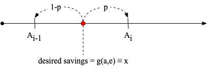
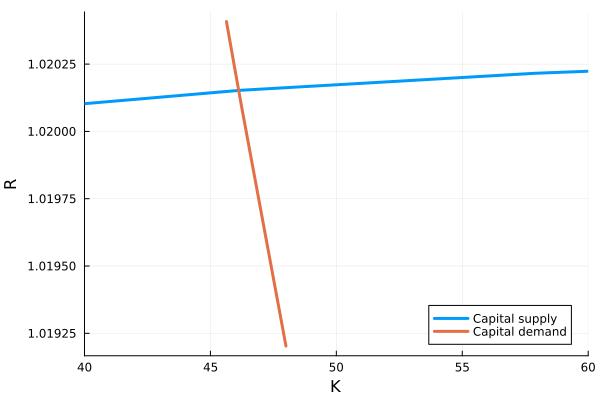

Stationary Equilibrium of Production Economy
==============================================

Now let's extend our model to general equilibrium of a production economy as in Aiyagari (1994).  Instead of being endowed with income, let's say the
consumer is endowed with random amounts of labor (efficiency units) that are sold at wage $W$ per efficiency unit.
So now the household budget constraint is
$$a' + c = R a + W e,$$
where now we interpret $e$ is the labor endowment.

Production takes place within a representative firm according to the production function
$$Y= F(K, L) = K^\alpha  L^{1-\alpha}.$$
During production, the capital depreciates by amount $\delta K$.
The first order conditions of the firm's problem are
$$ \begin{aligned}
  R &= \alpha \left( \frac{K}{L} \right)^{\alpha -1} + 1 - \delta \\
  W &= (1-\alpha) \left( \frac{K}{L} \right)^{\alpha} \\
\end{aligned}$$

The aggregate supply of capital comes from the savings of the households so we have
$$ K  = \int g(a,e) d \Gamma(a,e),$$
where $\Gamma(a,e)$ is the distribution of household over the state space. Similarly,
the aggregate supply of labor is given by
$$ L = \int e_i di = \int e d \Gamma(a,e).$$
$L$ will be determined by the ergodic distribution of the process for $e$ and
can be calculated separately from the rest of the model.

In specifying the model, the last step is to explain where the distribution $\Gamma$ comes from.
In a stationary equilibrium, the distribution of wealth is the one that recreates itself when households
follow the equilibrium savings rule $g$ and are subjected to the income shocks drawn from
$\Pi(e'|e)$.  Mathematically, given a distribution function $\Gamma_t$, define $\Gamma_{t+1}$ such that 
$$\Gamma_{t+1}(\mathbb A, e') = \sum_e \left[ \Pi(e'|e) \int_{\{a :g(a,e) \in \mathbb A \} }  d \Gamma_t(a,e)  \right]$$
for any set of asset holdings $\mathbb A$. A stationary distribution $\Gamma$ is one where $\Gamma_{t+1} = \Gamma_t$.

In practice we find the stationary distribution $\Gamma$ by simulating a population of households and the
standard algorithm for computing such an equilibrium is  as follows

  * Compute L from the stationary distribution of $e$
  * Guess K
  * Compute R and W from the firm first order conditions
  * Solve the household problem to get the decision rule $g$
  * Simulate a population of households to find the candidate $\Gamma$
  * Compute the implied aggregate capital holdings
  * If the implied capital holdings match the initial guess, stop. Otherwise, update the guess and repeat.

Non-Stochastic Simulation
-------------------------

To simulate a population of households we could use one of several approaches. For the work that comes
later it will be useful to use a particular version of non-stochastic simulation.  The broad idea is to
approximate $\Gamma(a,e)$ with $N_e$ histograms corresponding to the continuous distributions of $a$
associated with each of the values of $e$.  To do so we can use the same grid $A$ of $N_A$ points that
we used in the endogenous grid method.  Then let $D_j$ for $j\in\{1,2,\cdots,N_e\}$ be a vector of length $N_A$ that gives the mass of households on the histogram nodes $A$ for each value of $e_j$. These  vectors
$\{D_j\}_{j=1}^{N_e}$ then represent $\Gamma(a,e)$.

A small challenge with this approach is that the policy rule $g(a,e)$ will not necessarily
select values on the grid.  Therefore we need a method of allocating households to grid points
near their intended level of savings. To do so we use the guiding principle that the algorithm should
preserve the aggregate level of savings.  Suppose a unit mass of households have states $(a,e)$ such that
the decision rule selects a level of savings $x$ where $A_{i-1} \leq x < A_{i}$ then we will allocate a share $p$ of this mass to $A_{i}$ and a share $1-p$ of the mass to $A_{i-1}$ such that
$(1-p)A_{i-1} + p A_{i} = x$. This logic is summarized in the figure below.

Let $D$ without subscript represent the vectors $D_j$ stacked on top of one another. Then we can create a $N_eN_A \times N_eN_A$ transition matrix, $M$, that updates the distribution $D$ according to
$D' = M D$.  We create $M$ column by column.  For each pair of current state variables corresponding
to an element in $D$ we fill in $2N_e$ elements of $M$ corresponding to the two adjacent savings levels that the decision rule maps into according to the previous paragraph crossed with the probabilities of the $N_e$ possible realizations of next period's labor productivity.

The stationary distribution of wealth is then the ergodic distribution of the Markov chain $M$, which
is given by the Eigenvector of $M$ associated with the unit Eigenvalue normalized to sum to one.

## Further Implementation Details

To construct the matrix $M$, we can work with one pair of states $(a,e)$ at a time corresponding to a column of $M$. These states result in saving $g(a,e)=x$. We then find the $p$ that solves $(1-p)A_{i-1} + p A_{i} = x$ assuming that $x \in [A_{i-1}, A_{i}]$. This yields
$$p = \frac{x-A_{i-1}}{A_i - A_{i-1}}.$$
We then create an $N_A$ vector that has $p$ in location $i$ entry and $1-p$ in location $i-1$.  We then stack this vector $N_e$ times multiplying each by the exogenous transition probabilities $\Pi(e'|e)$.

## Codes 

See `Aiyagari.jl` for an implementation of these methods. The codes produce the supply and demand diagram below. As the interest rate rises, households save more and the supply of capital increases. On the other side of the market, firms demand less capital as the interest rate rises.

## Next step

Here, we have assumed that the economy remains in a stationary equilibrium. Next, we consider how the economy reacts to a temporary change in productivity. We do this by solving for a [perfect-foresight transition path](MIT.html).