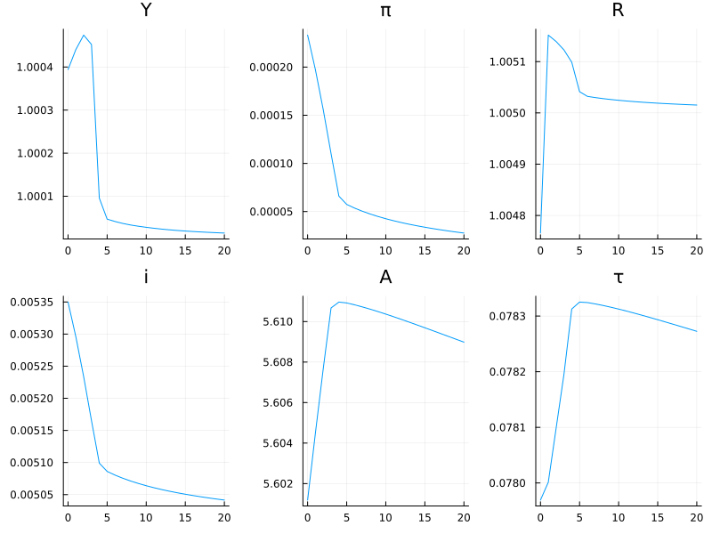

# HANK Models

We can now solve a Heterogeneous Agent New Keynesian model. In terms of computation, there is little differnece from what we have already done solving the model with the sequence-space Jacobians.  So most of this lecture is about formulating the model.

## The household block

Previously we have assumed a very basic model of households (e.g. only two income states). Let's take this opportunity to do something a bit more realistic.  We can assume that households have a stochastic endowment of labor efficiency with their log productivity $e_{it}$ following an AR(1) process. There are several ways of approximating a continuous AR(1) process with a Markov chain. For a highly persistent process, the preferred method is the [Rouwenhorst method](https://doi.org/10.1016/j.red.2010.02.002).  We will assume that the cross-sectional averge of $e_{it}$ is constant and equal to 1.

The households have preferences
$$\mathbb E_0 \sum_{t=0}^\infty \beta^t \left[u(c_t) - v(\ell_t)\right]$$
where $u(c) = c^{1-\gamma}/(1-\gamma)$ and $v(\cdot)$ is the disutility from labor supply.

We will assume that households save in a short-term nominal bond.  The ex-post real return on the bond is $1+r_t = \frac{1+i_{t-1}}{1+\pi_t}$, where we use the conventional timing that $i_t$ is the nominal rate between $t$ and $t+1$ and $\pi_t$ is the inflation rate between $t-1$ and $t$.  We will assume that the bond is in positive net supply because there is a stock of government debt outstanding. To pay interest on the debt the government imposes a proportional tax on household earnings. Finally, the government may pay a lump-sum transfer in amount $ \eta_t$.  The household's real budget constraint is
$$  c +  a' = (1-\tau) w_t e \ell + (1+r_t) a + \eta$$
where $w_t$ is the real wage (index).

It is common in the literature to assume that wages are set by unions who control the labor supply of the households and ration labor hours equally across households. In that case, $\ell$ is not in the control of the household. So the household's choice is simply to choose how much to consume and how much to save. We can use the endogenous grid method and non-stochastic simulation just as we did before.

## The supply side

Final goods are produced out of a labor aggregate according to $Y_t = L_t$, where $L$ is a CES aggregate of differentiated labor varieties supplied by unions. The market for final goods is competitive and the price $P_t$ is equal to the nominal marginal cost, which is the nominal wage index $W_t$.  This implies $Y_t = w_t L_t$, where $w_t = W_t / P_t$.  Due to the equal rationing of labor hours, we have $\ell = L$ so $w_t \ell$ in the household problem simplifies to $Y_t$.

The labor unions only adjust their wages infrequently resulting in a Phillips curve for wages and prices
$$\pi_t = \kappa \hat Y_t + \beta \pi_{t+1}.$$
Here $\hat Y_t$ is the log deviation of output from its natural level. We will assume that the natural level of output is constant (I am taking a shortcut here for simplicity) so $\hat Y_t$ is just the log deviation from steady state.

## Policy

Let's assume monetary policy follows a simple Taylor rule
$$i_t = \bar r + \phi \pi_t + \varepsilon_t$$
where $\bar r$ is the the steady state real interest rate and  $\varepsilon_t$ is a monetary shock that follows an AR(1).

Turning to fiscal policy, we assume the transfer $\eta_t$ is exogenous. Let $A_{t}$ be the real value of the debt issued at $t$ and repaid at $t+1$. The government budget constraint is
$$A_t=  (1+r_t)A_{t-1} -\tau_t Y_t + \eta_t.$$
Fiscal policy sets $\tau_t$ such that debt evolves as follows
$$A_t = (1-\rho_A) \bar A + \rho A_{t-1} + \eta_t -\bar \eta + r_t A_{t-1} - \bar r \bar A.$$
These two equations implicitly determine $\tau_t$.

## Equilibrium

The aggregate variables are $Y_t$, $\pi_t$, $r_t$, $i_t$, $A_t$, $\tau_t$, $\eta_t$, and $\varepsilon_t$.  These variables must satisfy asset market clearing
$$A_t = \int g_t(a,e) d\Gamma_t(a,e),$$
where $g_t$ and $\Gamma_t$ depend on the path of prices households face. In addition we have the Fisher equation, the Phillips curve, the two government policy rules, the government budget constraint, and the two exogenous sequences for $\eta_t$ and $\varepsilon_t$.

## Implementation and code

Let's start with the big picture: we are still formulating a set of equations of the form $f(X,E) = 0.$  In this case, $X$ contains the transition paths of the eight variables listed above so it has dimension $8T$, where $T$ is the length of the transition. Similarly, we have eight equations holding at each date so $f$ represents $8T$ equations.  We are going to partition $f$ into two blocks.  The first block contains the asset market clearing conditions at each date, which we construct with the heterogeneous-agent methods. We can differtiate this block with the Fake News algorithm.  The other block of dimension $7T$ contains the other equations at each date.  This block can be constructed and differentiated using the same methods we used for the RBC model.

``HANK_Script.jl`` uses the model described here to simulate a fiscal policy shock consisting of a temporary increase in transfers. The results are shown in the figure below.  With the increase in transfers, output increases leading to an increase in inflation and tighter monetary policy.  Income taxes rise slightly to gradually pay off the extra government debt.

 