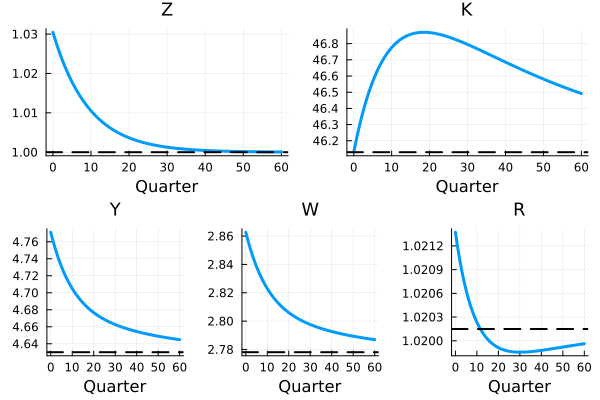

# Perfect-Foresight Transitions of the Aiyagari Economy

We are sometimes interested in how the economy evolves over time in response to a change in the environment. This change could either be transitory or permanent. Here we will consider a transitory change in aggregate TFP.  We assume that this change in TFP was unanticipated but after it occurs the dynamics of TFP are known perfectly. We call this a perfect-foresight transition or MIT shock. 

Suppose that the economy is subject to a transitory aggregate shock that was previously viewed as a zero-probability event.  Going forward, there is no uncertainty over the dynamics of the shock or other aggregate variables, but there can be uncertainty over the idiosyncratic variables.

Let's extend our discussion of the Aiyagari economy with a productivity shock $Z_t$. So now
$$Y_t = F(K_{t-1},L) = Z_t K_{t-1}^\alpha L^{1-\alpha}.$$

Suppose $Z=1$ in steady state and was expected to remain there when news arrives at $t=0$ that $Z$ will follow a path
 $\{Z_t\}_{t=0}^\infty$. Here we will assume this path is a temporary deviation from steady state so as $t$ grows large $Z_t$ returns to its steady state value.

Our goal is to compute
the path for $\{K_t,Y_t,R_t,W_t\}_{t=0}^\infty$.  To do so, we pick a length of the transition $T$ and we will assume that the economy is back in
the stationary equilibrium at $T$.  Using the production function and firm first-order conditions we can determine $\{Y_t,R_t,W_t\}_{t=0}^T$ from
$\{K_t\}_{t=0}^T$.  So the problem is to find an equilibrium path $\{K_t\}_{t=0}^T$.

To start, we will use an algorithm that reflects the one we used for the stationary equilibrium of the Aiyagari economy: we guess $\{K_t\}_{t=0}^T$, solve the household's problem, simulate the distribution of wealth, and then check market clearing.  The difference here is that  there is a time dimension to everything.

Given the guess $\{K_t\}_{t=0}^T$, we compute the return on capital and wage at each date from the firm's first-order condition.  We then solve the household's problem backwards in time taking these prices as given.  We can again use the endogenous grid method but now we need to specify which time period the prices and policy rules correspond to.

Like before, suppose the consumer has labor endowment $e$ at date $t$ and saves an amount $A$. The the savings first-order condition can be written as
$$
u'(c_t) \geq \beta  \mathbb E V_{a,t+1}(A,e') 
$$
where the subscript $t+1$ indicates that $V_{a,t+1}$ is the marginal value of assets at date $t+1$. Given $V_{a,t+1}$ we can compute the right-hand side and solve this equation for $c_t$.
Next we use the budget constraint to solve for the savings policy rule $a = (c_t + A - W_t e)/R_t$.
We now have a mapping from $(a,e)$ to $A$ in period $t$ which is the policy rule $g_t(a,e)$. We begin these steps in $T$ using the steady state envelope condition as $V_{a,T+1}(a,e)$.  We then iterate backwards in time to arrive at $\{g_t(a,e)\}_{t=0}^{T}$.

Once we have the policy rules, we simulate the distribution of wealth forwards through time.  That is, entering date $0$, the distribution of wealth is the steady state distribution. We then update this with the policy rules from date $0$.  Let $M(g_t)$ be the non-stochastic simulation transition matrix using the saving policy rule $g_t$.  Let $D^*$ be the steady state distribution.  We then set $D_{0} = D^*$ and $D_{t+1} = M(g_t) D_{t}$ for  $t \in 0,...,T$.

We can now compare the capital stock implied by the distribution of wealth
 $$\tilde K_{t} \equiv \int g_t(a,e) d \Gamma_t(a,e),$$
where $\Gamma_t$ is the distribution approximated by $D_t$.  Our goal is that $\tilde K_t = K_t \forall t$, where $K_t$ is our guess.  If that's not the case we need to adjust our guess.  The difficult part of the algorithm is how to update the guess so as to move towards market clearing.  A simple alogithm tends to work in this example: make the new guess a convex combination of the previous guess and $\tilde K_t$. Suppose in iteration $j$ we guess 
$\{K_t^{(j)}\}_{t=0}^T$ and the implied capital supply is $\{\tilde K_t^{(j)}\}_{t=0}^T$. We then set
$$K_t^{(j+1)} = K_t^{(j)} + s \left( \tilde K_t^{(j)} - K_t^{(j)}\right)$$
for some step size $s\in(0,1]$.

## Codes

See `MIT.jl` for an application where we simulate a 3% positive TFP shock. The transition path should look like the figure below.

## Relation to $f(X,E)=0$ and next step

The algorithm above can be expressed as a single non-linear equation that takes the vectors $K = \{K_t\}_{t=0}^T$ and $Z = \{Z_t\}_{t=0}^T$ as arguments and sets $\{\tilde K_t - K_t\}_{t=0}^T$ to zero. The algorithm then can be interpreted as solving this non-linear  equation $f(K,Z)=0$ using a version of Newton's method in which we guess the Jacobian of $f$ with respect to $K$ is $s^{-1} I,$ where $I$ Is the $T\times T$ identity matrix.  When solving the equation non-linearly, using the wrong Jacobian is not a problem provided that we find a solution $f(K,Z)=0$  (the Jacobian is only a means of moving towards a solution).  However, when we work with richer models, a simple guess of approximate Jacobians typically don't work because there are too many interdependencies between variables and across time periods. This leads us to the issue of how to compute the Jacobian of $f(X,E)$ when $f$ includes equations that depend on the aggregate behavior of a group of heterogeneous agents. [We discuss that next](SSJac.html).