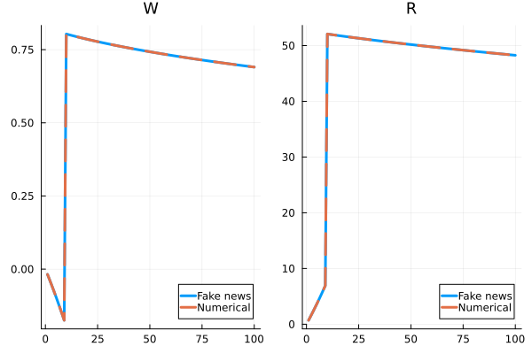

<!-- title: Heterogeneous agent modeling: sequence-space Jacobians -->

# Sequence-space Jacobians

In this lecture we will analyze the same problem as in the last lecture, but instead of using an approximate Jacobian for updating our guess of the transition path, we will use the true Jacobian.  Because we are dealing with equilibria of aggregate varibles expressed in sequential form (as opposed to recursive form) these are "sequence-space Jacobians."  [Auclert et al (2021)](https://onlinelibrary.wiley.com/doi/epdf/10.3982/ECTA17434) introduced this approach to solving heterogeneous agent models.  Here, I will stick to the big picture of the approach and refer you to Auclert et al for details.

To review, we are solving for a perfect foresight transition path of an Aiyagari economy. As we discussed, the problem requires us to solve for the equilibrium path of the capital stock $\{K_t\}_{t=0}^T$ where we assume we are back in steady state after period $T$.  Solving the household's decision problem and simulating the population of households gives us an equation of the form $\tilde K_t - K_t = 0$ for all $t$ where $\tilde K_t$ is the implied capital stock from the household behavior. Given the path of TFP, the calculation can be expressed as $f(K,Z) = 0$ where $K$ and $Z$ are vectors giving the paths of capital and TFP.  Our goal is to compute the Jacobians $f_K$ and $f_Z$. These Jacobians depend on the point at which we differentiate, and in this lecture we will always be taking derivatives at steady state.

Let's consider the details of how we compute $\tilde K_t$.  The aggregate savings of the households are
$$\begin{aligned}
\tilde K_t &= \int g_t(a,e) d \Gamma_t(a,e) \\
&= \underbrace{g_t'}_{1\times N_e N_A} \cdot D_t
\end{aligned}
$$
To understand the second line, recall that $D$ is a histogram that gives the mass of households with different combinations of $(a,e)$. Let $g_t$ be the vector of the same shape as $D$ that reports the savings of households with those combinations of states $(a,e)$. These savings policy rules depend on $t$ because they depend on the currnet and future prices.

Our interest is in how $\tilde K_t$ changes with the guess of $K_t$.  Later, we may have multiple prices that we feed into the household block so let's use $X$ to denote the whole path of prices that is relevant to the households. If there are 3 prices at each time period, $X$ is a $3T$ vector.  Our quession is now to compute $d \tilde K_t / dX$.  Again, we take the derivatives at steady state and the steady-state version of $X$ simply stacks the steady-state prices $T$ times.  From above we have
$$ d \tilde K_t = \bar g' \cdot d D_t + d g_t' \cdot \bar D,$$
where bars are values in the stationary equilibrium. The fake news algorithm of Auclert et al is a computationally fast way to compute these deriviaives. 

## Systems of equations in the sequence space

In more complicated models, we may not be able to (or may not want to) reduce the calculation to finding the transition path for a single variable. Instead we may need to solve jointly for the transition paths of several variables.  In the example above, we used the  first order conditions for capital and labor demand by the firm to eliminate $W$ and $R$ and express the model in terms of a single unknown, $K$. Suppose we don't do this and instead solve for the transition paths of all three variables at the same time. We then need $3T$ equations for our $3T$ unknowns.  The equations are $K_t = \tilde K_t$ and the firm first order conditions at each date.  The first order conditions are easy to code just as in our RBC example.  So then the approach is as follows: code the ``easy equations'' directly and then stack them on top of the heterogeneous agent block that involves solving backwards for decision rules and simulating forwards to obtain aggregate outcomes.  We can use automatic or symbolic differentiation to get the Jacobians of the easy equations and then use the fake news algorithm to get the Jacobians of the heterogeneous agent block.  Again, we stack these Jacobians on top of each other.  The end result is a system of the form $f(X,E) = 0,$ just as in the RBC example, but instead of having the representative-agent Euler equation, we have the heterogeneous-agent block.

## Codes and next step

See `SSJac.jl` for an example of simply computing the sequence-space Jacobians of $\tilde K$ with respect to $W$ and $R$. As a test, we can compare one or more columns of the Jacobians against a brute force numerical derivative.  The numerical derivative is fine for one column of the Jacobian, but computing the whole Jacobian this way would take some time. The results should look like this:

See `Transition_SSJ.jl` for an example of computing the non-linear transition path following a TFP shock by using the sequence-space Jacobians and Newton's method.  This script yields the same solution as `Transition_naive.jl`. Using the sequence-space Jacobians is  faster as convergence is obtained in just a few iterations, but the difference may seem underwhelming.  The purpose of doing the Jacobians is that they allow us to tackle more complicated models in which there is no obvious naive approach. Next, we consider a richer application in the form of a [HANK model](HANK.html).